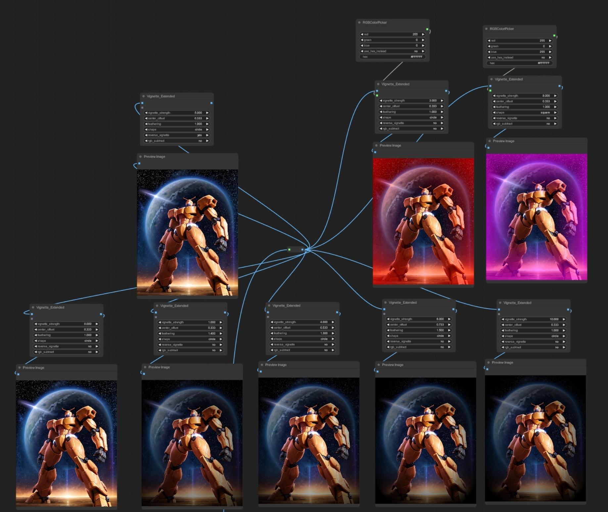

# ComfyUI-VignetteNode
ComfyUI-VignetteNode

- Strength: 0.0-10.0, normalized
- Feathering: 0.1-2.0, feather effect from center
- Shape: 'circle', 'ellipse', 'square' - square looks more like an X
- Reverse: default 'no' for normal vignette on the edges, 'yes' to apply vignette color from the center
- Center offset: vignette start offset from center
- Color: optional vignette RGB tuple, use included RGBColorPicker
- Use RGB Subtract: do pixel math instead of just interpolating images. e.g. with no color input, adds a white vignette. Input of (255,0,0) would subtract all red value from the image in the vignette area instead of adding a red vignette, and so on.

